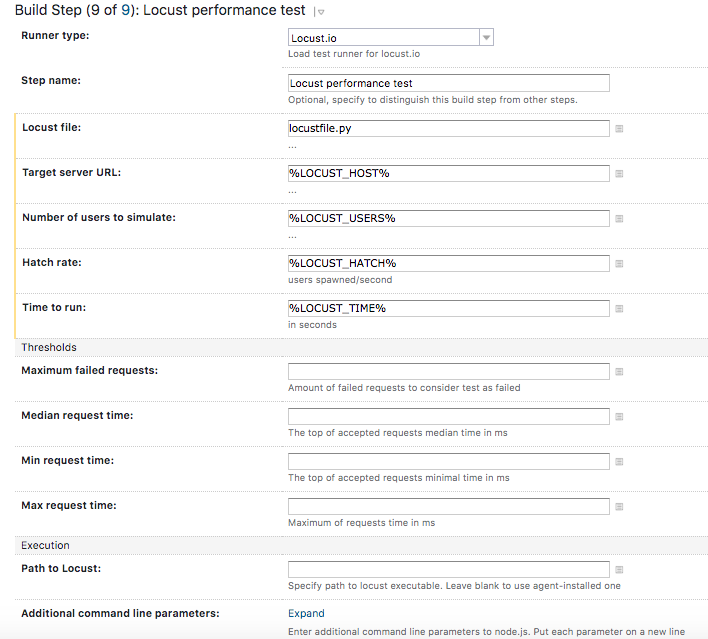
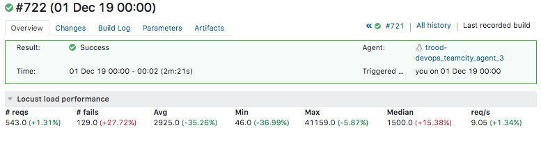
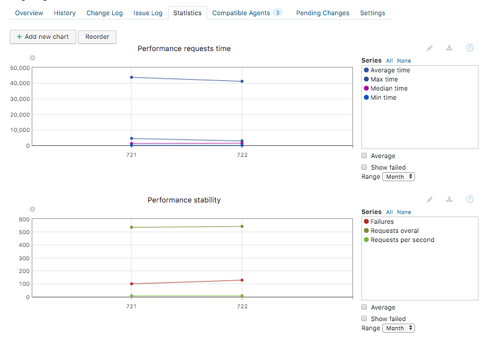

# teamcity-locustio 

Configurable [Locust.io][1] test runner plugin for JetBrains Teamcity.

## About the plugin

The purpose of creating this plugin was to integrate [Locust.io][1] performance tests tool with 
TeamCity builds in more user friendly and useful manner. 
Plugin adds a certain kind of statistic reports, results comparison between builds and more. 

## Features

- Configurable build step for running Locust tool
- Locust report parser for using on Build Statistics tab and charts
- Comparing report values with previous build (so you see regression)
- Configurable thresholds for making build success/fail decision 

## Installation and Configuration

1. Download the latest plugin build from available [releases][2]. 

2. Install plugin as described in official [TeamCity documentation][3].

3. Setup [Locust.io][1] tools on your TeamCity  Agent machine.

4. Add a newly available build step to your project Build Configuration:

5. Ensure you have proper `locustfile.py` added to your project and run build.

6. Wait for build finishes and you'll be able to se a new Locust section on build overview page:   

7. Use `Build > Parameters > Reported statistic values` tab to create a Chart with values you want to observe

## License
Apache 2.0

[1]: https://locust.io
[2]: https://github.com/orn0t/teamcity-locustio/releases
[3]: https://www.jetbrains.com/help/teamcity/installing-additional-plugins.html